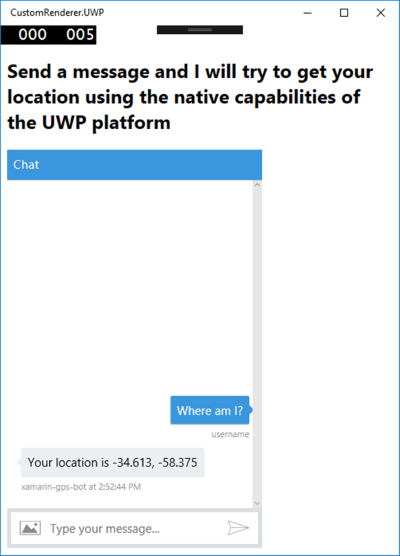

# XAmarin + BackChannel Bot Sample

A sample showing how to interact with a bot via BackChannel from a Xamarin solution.

### Prerequisites
The minimum prerequisites to run this sample are:
* The latest update of Visual Studio 2015. You can download the community version [here](http://www.visualstudio.com) for free.
* The Xamarin Platform. You can download it from [here](https://www.xamarin.com/platform) for free.
* Latest Node.js with NPM. Download it from [here](https://nodejs.org/en/download/).
* **[Recommended]** Visual Studio Code for IntelliSense and debugging, download it from [here](https://code.visualstudio.com/) for free.
* Register your bot with the Microsoft Bot Framework. Please refer to [this](https://docs.botframework.com/en-us/csharp/builder/sdkreference/gettingstarted.html#registering) for the instructions.
* Enable the Direct Line channel, edit the settings  
   

  and add a new site to get the Direct Line secret key.
  
  
  
  Refer to [this](https://docs.botframework.com/en-us/csharp/builder/sdkreference/gettingstarted.html#channels) for more information on how to configure channels. 
* Replace _"YourSecretKeyhere"_ on the `index.html` file of each platform ([Android](Droid/Assets/Content/index.html), [iOS](iOS/Content/index.html), [Universal Windows](UWP/Content/index.html), [Windows Phone 8.1](WinPhone81/Content/index.html)) with the Direct Line secret key.
	
	````JS
	var params = { s: 'YourSecretKeyhere' };
	````
* Update the `ChatConnector`'s constructor in the [connectorSetup.js](backGpsChannelBot/connectorSetup.js) file with your bot's credentials.
	
	````JS
	var connector = new builder.ChatConnector({
			appId: process.env.MICROSOFT_APP_ID ? process.env.MICROSOFT_APP_ID : 'YourBotId',
			appPassword: process.env.MICROSOFT_APP_PASSWORD ? process.env.MICROSOFT_APP_PASSWORD : 'YourBotPassword',
			gzipData: true
		});
	````

### Code Highlights

Every Xamarin.Forms view has an accompanying renderer for each platform that creates an instance of a native control. When a View is rendered by a Xamarin.Forms application in iOS, the ViewRenderer class is instantiated, which in turn instantiates a native UIView control. On the Android platform, the ViewRenderer class instantiates a View control. On Windows Phone and the Universal Windows Platform (UWP), the ViewRenderer class instantiates a native FrameworkElement control. For more information about the renderer and native control classes that Xamarin.Forms controls map to, see [Renderer Base Classes and Native Controls](https://developer.xamarin.com/guides/xamarin-forms/custom-renderer/renderers/).
The rendering process can be used to implement platform-specific customizations by creating a custom renderer for a View on each platform. 

The HybridWebView custom control is created in the portable class library (PCL) project and defines the following API for the control:

* A Uri property that specifies the address of the web page to be loaded.
* A RegisterAction method that registers an Action with the control. The registered action will be invoked from JavaScript contained in the HTML file referenced through the Uri property.
* A CleanUp method that removes the reference to the registered Action.
* An InvokeAction method that invokes the registered Action. This method will be called from a custom renderer in each platform-specific project.

The `CustomRenderer` project is a Portable Class Library (PCL) project. Portable Class Libraries allow you to write code and produce libraries that can be shared across multiple platforms including Xamarin.iOS, Xamarin.Android and Windows Phone 

The purpose of this sample is show how bots, via BackChannel, can interact with Xamarin apps, in this case to retrieve the GPS location using the mobile sensors. The sample consists of a set of Xamarin projects (the PCL project and one project for each of the platforms) and the bot which was built using Node.js.

Each Xamarin project has an ´index.html´ page with an embedded chat control. The bot running in nodeJS process the messages and creates a event message that is returned to the caller in ´index.html´ which invoke each platform custom implementation of [IGpsDataProvider](CustomRenderer/Interfaces/IGpsDataProvider.cs) to provide the GPS location in each device.

````JS
botConnection.activity$.filter(function (activity) { return activity.type === "event" && activity.name === "getUserLocation" })
	.subscribe(function (activity) {
		invokeCSharpAction('');
	});
````

After the native custom implementation is called and the GPS location is returned as a [Position](CustomRenderer/Models/Position.cs) model, the `gpsCallback` JavaScript function in the `index.html` is called with the coordinates and then it calls again the bot with a event message with the coordinates as value. This `event` is intercepted by the following code in the [apps.js](backGpsChannelBot/app.js) in bot project and location is posted to the user.

````JS
bot.on("event", function (event) {
var msg = new builder.Message().address(event.address);
    msg.data.textLocale = "en-us";
    if (event.name === "userLocationObtained") {
        msg.data.text = "Your location is " + event.value;
    }
    bot.send(msg);
})
````

### Outcome
You will see the following result, depending the project you choose to run:

| iOS | Universal App | Android | Windows Phone |
|---|---|---|---|
|| ||

### More Information
To get more information about how to get started with the embeddable web chat control and the Direct Line for the Microsoft Bot Framework and Xamarin's HybridWebView please review the following resources:

* [Web chat control](https://github.com/Microsoft/BotFramework-webchat)
* [Introduction to Portable Class Libraries](https://developer.xamarin.com/guides/cross-platform/application_fundamentals/pcl/introduction_to_portable_class_libraries/)
* [Web View](https://developer.xamarin.com/guides/xamarin-forms/user-interface/webview/)
* [Working with WebView in Xamarin.Forms](http://developer.xamarin.com/guides/cross-platform/xamarin-forms/working-with/webview)
* [Implementing a HybridWebView](https://developer.xamarin.com/guides/xamarin-forms/custom-renderer/hybridwebview/)