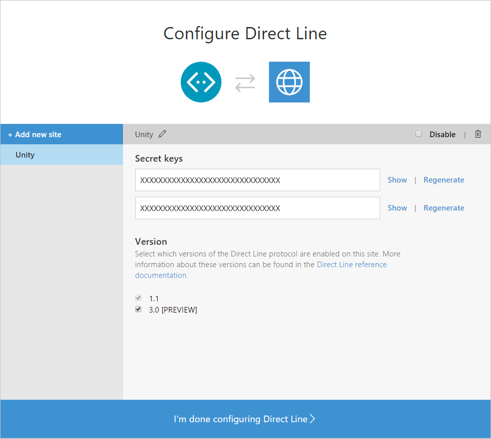
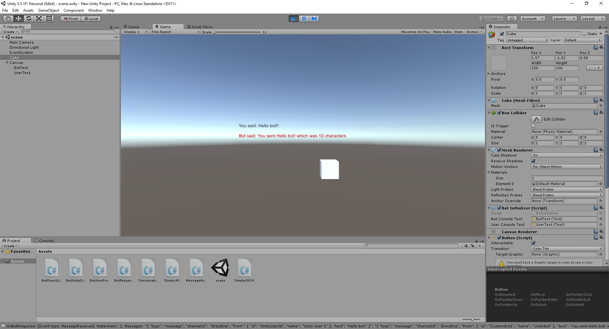

# Bot in Apps - Unity Sample

This sample show how bot can go beyond by becoming embedded into larger applications, in this case within Unity.

### Prerequisites
* The latest update of Visual Studio 2015. You can download the community version [here](http://www.visualstudio.com) for free.
* Unity 3d. You can download it from [here](https://store.unity.com/es). Personal edition is free.
* Register your bot with the Microsoft Bot Framework. Please refer to [this](https://docs.botframework.com/en-us/csharp/builder/sdkreference/gettingstarted.html#registering) for the instructions.
* Enable the Direct Line channel, edit the settings  
   
  and add a new site to get the Direct Line secret key.
  
  Refer to [this](https://docs.botframework.com/en-us/csharp/builder/sdkreference/gettingstarted.html#channels) for more information on how to configure channels. 
* Replace _"YourDirectLineToken"_ of the [`BotDirectLineManager.Initialize`](Assets/BotInitializer.cs#L17) call in the `Start` method of the [BotInitializer.cs](Assets/BotInitializer.cs) with the Direct Line secret key.

  ````C#
	BotDirectLineManager.Initialize("YourDirectLineToken");
  ````

### Code Highlights
The Direct Line API is a simple REST API for connecting directly to a single bot. This API is intended for developers writing their own client applications, web chat controls, mobile apps, or service-to-service applications that will talk to their bot.
Within the Direct Line API, you will find:
* An authentication mechanism using standard secret/token patterns
* The ability to send messages from your client to your bot via an HTTP POST message
* The ability to receive messages by WebSocket stream, if you choose
* The ability to receive messages by polling HTTP GET, if you choose
* A stable schema, even if your bot changes its protocol version

Check out the [`Start`](Assets/BotInitializer#L15-L24) method of the [`BotInitializer`](Assets/BotInitializer.cs) component starting a new conversation wit the bot using the [BotDirectLineManager](Assets/BotDirectLineManager.cs) component. This component is a wrapper of the [Direct Line API](https://docs.botframework.com/en-us/restapi/directline3/) and handle all the interactions with the bot.

````C#
public void Start()
{
    BotDirectLineManager.Initialize("YourDirectLineToken");
    BotDirectLineManager.Instance.BotResponse += this.OnBotResponse;

    if (this.conversationState.ConversationId == null)
    {
        this.StartCoroutine(BotDirectLineManager.Instance.StartConversationCoroutine());
    }
}
````

The responses of the interactions with Direct Line are being handled in the [`OnBotResponse`](Assets/BotInitializer#L26-L69) method of the [`BotInitializer`](Assets/BotInitializer.cs) component.

````C#
private void OnBotResponse(object sender, Assets.BotDirectLine.BotResponseEventArgs e)
{
    Debug.Log("OnBotResponse: " + e.ToString());

    switch (e.EventType)
    {
        case EventTypes.ConversationStarted:
            // Store the ID
            this.conversationState.ConversationId = e.ConversationId;
            this.StartCoroutine(BotDirectLineManager.Instance.SendMessageCoroutine(this.conversationState.ConversationId, "UnityUserId", UserToBotMessage, "Unity User 1"));

            break;
        case EventTypes.MessageSent:
            if (!string.IsNullOrEmpty(this.conversationState.ConversationId))
            {
                this.conversationState.PreviouslySentMessageId = e.SentMessageId;
                if (this.UserConsoleText != null)
                {
                    this.UserConsoleText.text = string.Format("You said: {0}!", UserToBotMessage);
                }

                // Get the bot's response(s)
                this.StartCoroutine(BotDirectLineManager.Instance.GetMessagesCoroutine(this.conversationState.ConversationId));
            }

            break;
        case EventTypes.MessageReceived:
            // Handle the received message(s)
            if (this.BotConsoleText != null)
            {
                var message = e.Messages.FirstOrDefault(x => x.ReplyToId == this.conversationState.PreviouslySentMessageId);

                if (message != null) 
                {
                    this.BotConsoleText.text = string.Format("Bot said: {0}", message.Text);
                }
            }

            break;
        case EventTypes.Error:
            // Handle the error
            break;
    }
}
````
Different actions are executed depending on the event type of the response. In this sample, as soon as the conversation is started, the message _"Hello bot!"_ is sent from the Unity User to the bot.

After the message is sent, a Text component is updated with the message text and a request to get all the messages that have been sent/received is issued.

In this sample, all the messages are retrieved since no watermark is provided. The messages are filtered to get the message the bot sent in response to the user message and the text is printed as well in the Unity app.

### Outcome
You will see the following result if you open the project in Unity 3d and run it. 



### More Information
To get more information about how to get started with the Direct Line API and Unity 3d please review the following resources:

* [Direct Line API - v3.0](https://docs.botframework.com/en-us/restapi/directline3/)
* [Unity 3d](https://unity3d.com/)