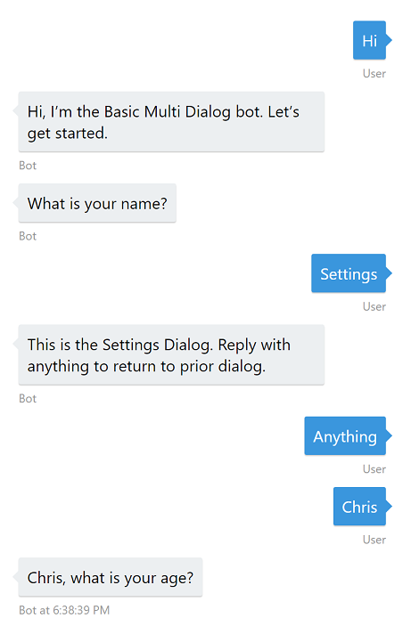
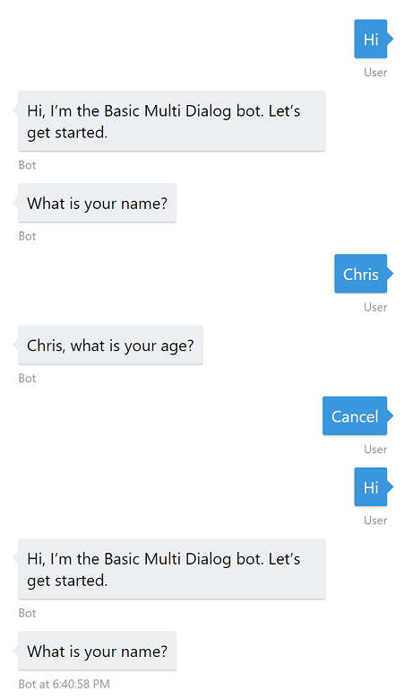

# Global Message Handlers Sample

You can use the [Bot Builder for .NET SDK](https://dev.botframework.com/) to define global message handlers that execute code whenever the user replies to the conversation with a specific word or phrase.

For example, you could add a settings command to your bot to show the bot's settings dialog whenever the user reponds with the word 'settings'. Additionally, you could define a cancel command to return the user to the Root Dialog whenever the user responds with the word 'cancel'.

This sample shows how to create global messages handlers to respond to global commands anywhere in your bot.

### Prerequisites

To run this sample, install the prerequisites by following the steps in the [Getting Started in .NET](https://docs.botframework.com/en-us/csharp/builder/sdkreference/gettingstarted.html) section of the documentation.

This sample is based on the Basic Multi-Dialog Sample, so be sure to review that sample before getting started with this one.

### Overview

The Bot Builder for .NET SDK uses [AutoFac](https://autofac.org/) for [inversion of control and dependency injection](https://martinfowler.com/articles/injection.html). If you're not famililar with AutoFac, you can learn more in this [Quick Start Guide](http://autofac.readthedocs.io/en/latest/getting-started/index.html).

One of the ways the Bot Builder for .NET SDK uses AutoFac is Scorables. Scorables intercept every message sent to the bot and apply a score to the message based on logic you define. The Scorable with the highest score 'wins' the opportunity to process the message. If no Scorable is found that applies to the message, the message is passed on to the active dialog on the dialog stack to become part of the conversation.

You can implement global message handlers by createing a Scorable for each global command you want to implement in your bot.

You create a Scorable by createing a class that implements the [`IScorable`](https://docs.botframework.com/en-us/csharp/builder/sdkreference/d2/dd9/interface_microsoft_1_1_bot_1_1_builder_1_1_internals_1_1_scorables_1_1_i_scorable.html) interface by inheriting from the [`ScorableBase`](https://docs.botframework.com/en-us/csharp/builder/sdkreference/de/d7b/class_microsoft_1_1_bot_1_1_builder_1_1_internals_1_1_scorables_1_1_scorable_base.html) abstract class. To have that Scorable applied to every message on the conversation, you define an AutoFac [`Module`](http://autofac.readthedocs.io/en/latest/configuration/modules.html) that registers your `ScorableBase` class as a [`Component`](http://autofac.readthedocs.io/en/latest/configuration/modules.html) and the `IScorable` interface as a [`Service`](http://autofac.readthedocs.io/en/latest/resolve/index.html). Registering that `Module` with the [`Conversation`](https://docs.botframework.com/en-us/csharp/builder/sdkreference/d9/de8/class_microsoft_1_1_bot_1_1_builder_1_1_dialogs_1_1_conversation.html)'s `Container` will apply your Scorable to all incoming messages in the `Conversation`.

Let's look at how this is done in the sample.

### Create the Settings Dialog

The [`SettingsDialog`](Dialogs/SettingsDialog.cs) is the dialog we'll add to the dialog stack whenever the user responds with 'settings' in the conversation.

````C#
public class SettingsDialog : IDialog<object>
{
    public async Task StartAsync(IDialogContext context)
    {
        await context.PostAsync("This is the Settings Dialog. Reply with anything to return to prior dialog.");

        context.Wait(this.MessageReceived);
    }

    private async Task MessageReceived(IDialogContext context, IAwaitable<IMessageActivity> result)
    {
        var message = await result;

        if ((message.Text != null) && (message.Text.Trim().Length > 0))
        {
            context.Done<object>(null);
        }
        else
        {
            context.Fail(new Exception("Message was not a string or was an empty string."));
        }
    }
}
````

### Create SettingsScorable

The [`SettingsScorable`](Dialogs/SettingsScorable.cs) provides an implementation of the `ScorableBase` abstract class in order to implement the `IScorable` interface. 

In the `PrepareAsync()` method, we inspect the incoming message to see if it matches the text we are looking for ('settings'). If there's a match, we return the message to be used as state for scoring, otherwise we return null (no match). 

````C#
protected override async Task<string> PrepareAsync(IActivity activity, CancellationToken token)
{
    var message = activity as IMessageActivity;

    if (message != null && !string.IsNullOrWhiteSpace(message.Text))
    {
        if (message.Text.Equals("settings", StringComparison.InvariantCultureIgnoreCase))
        {
            return message.Text;
        }
    }

    return null;
}
````
The `HasScore()` method is called by the calling component to determine if the Scorable has a score (we have a match).

````C#
protected override bool HasScore(IActivity item, string state)
{
    return state != null;
}
````
The `GetScore()` method is called by the calling component to get the score for this Scorable. This score is compared to all other Scorables that have a score. 
````C#
protected override double GetScore(IActivity item, string state)
{
    return 1.0;
}
````
The Scorable with the highest score will process the message when the `PostAsync()` method is called by the calling component. In the `PostAsync()` method, we add the `SettingsDialog` to the stack so it will become the active dialog.
````C#
protected override async Task PostAsync(IActivity item, string state, CancellationToken token)
{
    var message = item as IMessageActivity;

    if (message != null)
    {
        var settingsDialog = new SettingsDialog();

        var interruption = settingsDialog.Void<object, IMessageActivity>();

        this.stack.Call(interruption, null);

        await this.stack.PollAsync(token);
    }
}
````
When the scoring process is complete, the calling component calls the `DoneAsync()` method where any resources used in scoring are freed.
````C#
protected override Task DoneAsync(IActivity item, string state, CancellationToken token)
{
    return Task.CompletedTask;
}
````
### Create Module to Register Components and Services
In [`GlobalMessageHandlersBotModule`](GlobalMessageHandlersBotModule.cs), we define a `Module` that registers the `SettingsScorable` as a Component that provides the `IScorable` service.
````C#
public class GlobalMessageHandlersBotModule : Module
{
    protected override void Load(ContainerBuilder builder)
    {
        base.Load(builder);

        builder
            .Register(c => new SettingsScorable(c.Resolve<IDialogStack>()))
            .As<IScorable<IActivity, double>>()
            .InstancePerLifetimeScope();
    }
}
````

### Register the Module with the Conversation's Container
In [`Global.asax.cs`](Global.asax.cs), the `SettingsScorable` can be applied to the `Conversation`'s `Container` by registering the `GlobalMessageHandlersBotModule` with the `Container`.
````C#
public class WebApiApplication : System.Web.HttpApplication
{
    protected void Application_Start()
    {
        this.RegisterBotModules();

        GlobalConfiguration.Configure(WebApiConfig.Register);
    }

    private void RegisterBotModules()
    {
        var builder = new ContainerBuilder();

        builder.RegisterModule(new ReflectionSurrogateModule());

        builder.RegisterModule<GlobalMessageHandlersBotModule>();

        builder.Update(Conversation.Container);
    }
}
````
### Implementing CancelScorable
The [`CancelScorable`](Dialogs/CancelScorable.cs) is implemented the same way, but resets the dialog stack when the Scorable is called.
````C#
protected override async Task PostAsync(IActivity item, string state, CancellationToken token)
{
    this.stack.Reset();
}
````

### Outcome

Here's what the conversation looks like in the [Bot Framework Emulator](https://docs.botframework.com/en-us/tools/bot-framework-emulator/#navtitle) when replying to the `NameDialog` with 'settings'. Note: When the `SettingsDialog` completes, the `NameDialog` is returned to the top of the dialog stack, so the next reply will respond to the 'What is your name?' prompt.



Here's what the conversation looks like when replying to a the `AgeDialog` with 'cancel'. Note: When `CancelScorable` is complete, the dialog returns to the [`RootDialog`](Dialogs/RootDialog.cs), which waits for a message from the user ('Hi' below) before showing it's greeting and the first prompt.



### More Information

For more information on creating global message handlers using Scorables, check out the following resources:
* [AutoFac](https://autofac.org/) 
* [AutoFac Quick Start Guide](http://autofac.readthedocs.io/en/latest/getting-started/index.html)
* [IScorable](https://docs.botframework.com/en-us/csharp/builder/sdkreference/d2/dd9/interface_microsoft_1_1_bot_1_1_builder_1_1_internals_1_1_scorables_1_1_i_scorable.html)
* [ScorableBase](https://docs.botframework.com/en-us/csharp/builder/sdkreference/de/d7b/class_microsoft_1_1_bot_1_1_builder_1_1_internals_1_1_scorables_1_1_scorable_base.html)

